## MaxHotbarToolSlots

This setting controls the maximum amount of tool slots allowed to be used reguardless of the client's screen size.

_Setting set to 5_

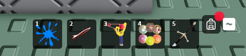

## MinHotbarSlots

This setting controls the minimum amount of tool slots allowed to be used reguardless of the client's screen size.

_Setting set to 6_

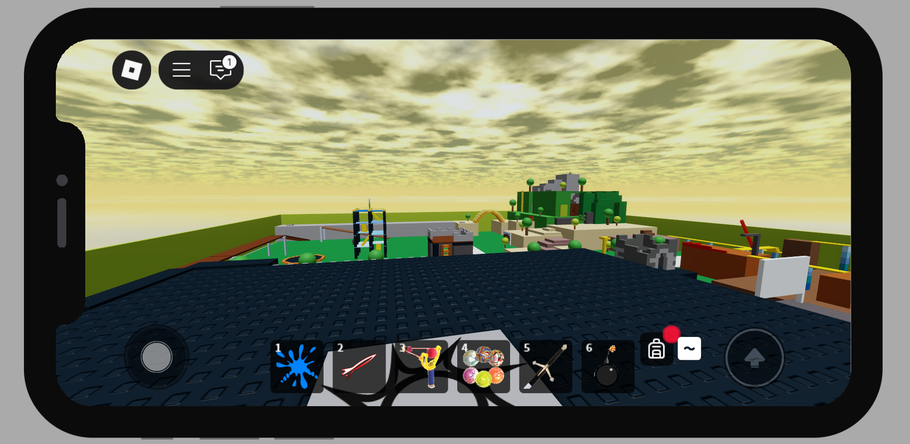

## NeededFreeSpace

This setting determines how many pixels is "reserved" when calculating how many tool slots the client should have.

!!!notice 
    Having a higher number may result in less tool slots.

## EquipCooldown

This setting determines how long the client has to wait in between equipping. Useful for preventing equip spam.

## ViewportSpeed

This setting determines how fast tools move in their viewport frame.

_Setting set to 10_

## SweepInterval

This setting determines how long it takes for reusable inventory slots to be destroyed.

When a inventory slot is created for a tool, BackpackManager does not delete it immediately when it is not needed anymore instead BackpackManager reuses slots whenever one is needed. These reusable slots are only deleted when a sweep occurs.

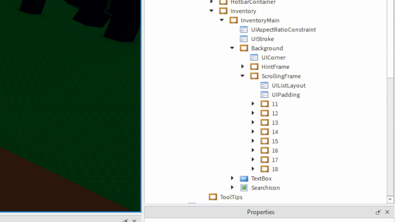

## MaxHeldTools

This setting determines how many tools can be held at once by the player.

_Setting set to 3_

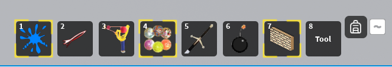

## DragWaitTime

This setting determines how long the player needs to hold left click on a tool before it starts dragging.

_Setting set to 1_

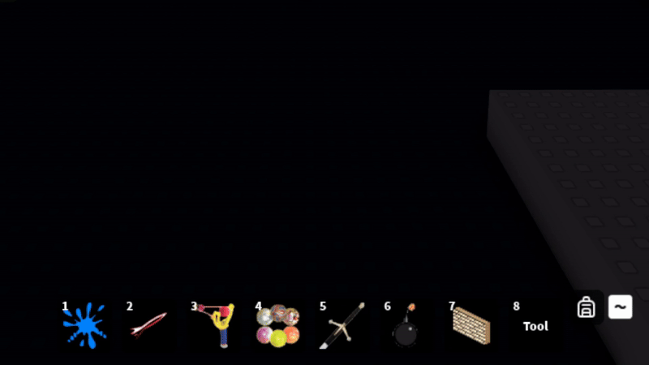

## ToolTipSpeed

This setting determines how fast tool tips display.

_Setting set to 0.012_

## AutoCalculateMaxToolSlots

This setting determines if BackpackManager will dynamically set the max tool slots depending on screen size.

!!!notice 
    This setting will respect the preset maximum and minimum tools by the developer and will never go below the minimum or above the maximum.

_Setting set to true_

## UseViewportFrame

This setting when enabled will automatically display tools in viewport mode.

_Setting set to true_

## UseScrollWheel

This setting when enabled will allow for the client to cycle through tools using their mouse's scroll wheel.

## CanOrganize

This setting determines if the client is allowed to move tools.

## Animate

This setting determines if BackpackManager will use animations.

_Setting set to false_

## AutoSortSlots

This setting determines if BackpackManager will automatically sort tool slots when a tool is removed.

_Setting set to true_

## PreventEquippingOnToolCooldown

This setting determines if a tool that has a cooldown active on it will be allowed to be equipped.

## UseGamepadCursor

This setting determines if the gamepad cursor is used when the inventory is opened.

_Setting set to true_

_Setting set to false_

## ShowHints

This setting determines if input hints are shown.

_Setting set to true_

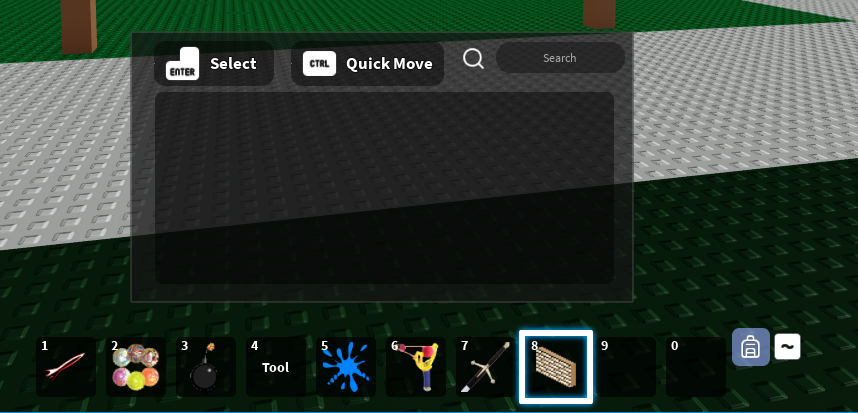

## ShowBackpackIcon

This setting determines if the backpack icon will be displayed.

_Setting set to true_

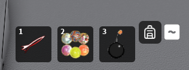

_Setting set to false_

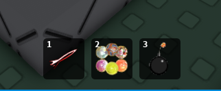

## ShowInactiveHotbarSlots

This setting determines if unused hotbar slots are displayed.

_Setting set to true_

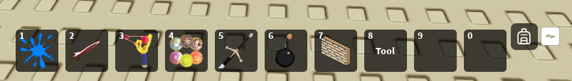

_Setting set to false_

!!! notice
    If this setting is disabled then you will have to implement your own backpack button for mobile users to access the inventory.

## BackpackButtonOpenedColor

This setting determines the color of the backpack icon's color when the inventory has been opened.

_Setting set to RGB(203, 53, 53)_

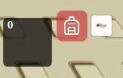

## DesiredPadding

This setting determines the spacing of tool slot gui elements.

_Setting set to UDIM(0, 2)_

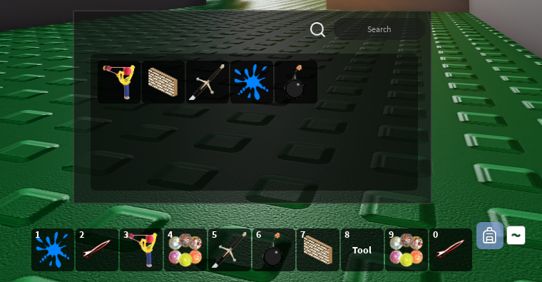

## InventoryYOffset

This setting determines the offset of the inventory in the Y axis.

## HotbarYOffset

This setting determines the offset of the hotbar in the Y axis.

## GlueContainerXOffset

This setting determines the offset of the glue container in the X axis.

## BackpackButtonXOffset

This setting determines the offset of the backpack button in the X axis.

## BackpackButtonYOffset

This setting determines the offset of the backpack button in the Y axis.

## SlotAnimateStartYOffset

This setting determines the start offset of the highlight in the Y axis.

## SlotAnimateStartXOffset

This setting determines the start offset of the highlight in the X axis.

## ToolTipYOffset

This setting determines the offset of tool tips in the Y axis.

## INVENTORY_OPENANDCLOSE_KEYCODES

This setting determines which keybinds open and close the inventory.

## FASTMOVE_KEYCODES

This setting determines which keybinds while pressing left click on a tool while the inventory is opened will preform a fast move.

## GUI_SELECTION_KEYCODES

This setting determines which keybinds will select tool slots while in UI navigation mode.

## CYCLE_LEFT_KEYCODES

This setting determines which keybinds will cycle left through the hotbar.

## CYCLE_RIGHT_KEYCODES

This setting determines which keybinds will cycle right through the hotbar.